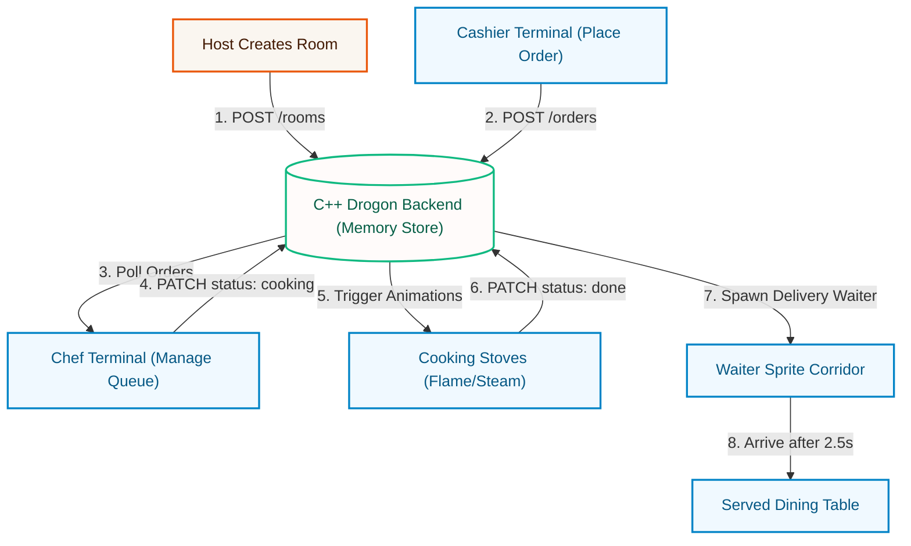

<p align="center">
  
</p>

# Bon appétit Flow

The backend of **Bon appétit Flow** is built with C++20 and the **Drogon Web Framework**, offering ultra-low latency and highly concurrent memory state handling. Below is a detailed micro-explanation of how the rooms, kitchen flow, and web architecture operate under the hood.

---

## ⚙️ How the System Works (Micro-Architecture)



### 1. The Multi-Room Lifecycle (Isolated Workspaces)
To support multiple independent restaurants or branches simultaneously, the backend utilizes an in-memory multi-room design:
* **Creation:** A host client requests a room by submitting a `secretKey`. The server generates a unique `roomId` (e.g. `room_a2b3c4`) and hashes the secret key using SHA-256 salted with the `roomId`.
* **State Isolation:** Each Room contains its own mutex-guarded `orders` map, isolating all data transactions.
* **Expiration:** Rooms are stored entirely in RAM for speed. They expire and are automatically garbage-collected after 10 hours of inactivity, or when a device exceeds the limit of 3 concurrent active rooms (where the oldest room is automatically deleted).

### 2. The Kitchen Order Workflow (State Transitions)
Every order flows through a strict state machine to prevent order duplicates or loss:
1. **WAITING:** The order is submitted by the Cashier. It lands on the kitchen's **Queue Board** (prep station).
2. **COOKING:** A chef clicks the order card or stove, changing the status to `cooking`. The stove on the floor plan lights up with flame and steam animations.
3. **DONE (Delivery Trigger):** The chef clicks **"Serve"** or **"Finish Cooking"**. The order status changes to `done`. This initiates the clientside delivery pipeline:
   - The waiter sprite carrying food walking across the corridor is animated.
   - The finished plate is hidden from the dining area until the waiter walk animation completes (2.5 seconds).
   - Once the waiter arrives, the plate lands on the table.

### 3. Thread-Safe Concurrency Model (Under the Hood)
Because the server is a multi-threaded non-blocking HTTP framework, it utilizes fine-grained locking:
* **Global Registry Lock:** The global room map (`state::rooms`) is protected by a global mutex when rooms are created or listed.
* **Local Room Lock:** Each Room object holds a dedicated `std::mutex` lock. When an order is created or status is patched, only that specific room's mutex is locked. This ensures that concurrent updates in Room A never block updates in Room B.

---

## 🛠️ Tech Stack & Key Components

- **Framework:** Drogon MVC (Non-blocking, event-driven HTTP server)
- **JSON parser:** `nlohmann/json`
- **Crypto:** OpenSSL (SHA-256)
- **Build tool:** CMake

---

## 🔒 Security & Concurrency Design

### 1. Header-Based Authentication (`X-Device-Key`)

When a room is created, a SHA-256 hash is generated using:

```
hashedSecretKey = SHA-256(rawSecretKey + "_" + roomId)
```

For all subsequent queries (`GET /rooms/{roomId}`, `GET /rooms/{roomId}/orders`, `POST /orders`, and `PATCH /orders`), clients must include the raw secret key in the `X-Device-Key` header. The server re-hashes it and compares it with the stored key hash. If they do not match, the server returns `401 Unauthorized`.

### 2. Device Room Rate Limiting

To prevent memory exhaustion, each device (identified by a `device_token` Cookie) can host a maximum of **3 active rooms** at any given time. Creating a 4th room automatically deletes the oldest room hosted by that device.

### 3. Thread-Safe In-Memory Storage

Since room states are kept entirely in memory for high speed, the server uses:

- A **global mutex** (`state::globalMutex`) for room creation and listing.
- **Room-level mutexes** (`room->mutex`) to guard orders list modifications, preventing race conditions when multiple cashiers place orders or multiple chefs update order statuses simultaneously.

---

## 📡 API Endpoints

| Method  | Endpoint                           | Description                 | Auth Required        |
| :------ | :--------------------------------- | :-------------------------- | :------------------- |
| `POST`  | `/rooms`                           | Create a new room           | No                   |
| `GET`   | `/rooms/{roomId}`                  | Verify and get room details | Yes (`X-Device-Key`) |
| `GET`   | `/rooms/{roomId}/orders`           | Retrieve all orders in room | Yes (`X-Device-Key`) |
| `POST`  | `/rooms/{roomId}/orders`           | Place a new order           | Yes (`X-Device-Key`) |
| `PATCH` | `/rooms/{roomId}/orders/{orderId}` | Update order status         | Yes (`X-Device-Key`) |

---

## 🔨 How to Build and Run

### Prerequisites (Ubuntu/Debian)

Install Drogon dependencies, json library, and openssl:

```bash
sudo apt-get install git cmake g++ libjsoncpp-dev uuid-dev zlib1g-dev libssl-dev
# Install nlohmann/json
sudo apt-get install nlohmann-json3-dev
```

### Compile Backend

1. Go to the backend directory:
   ```bash
   cd be
   ```
2. Create compile build scripts:
   ```bash
   mkdir build && cd build
   cmake ..
   ```
3. Compile using make:
   ```bash
   make
   ```
4. Run the backend server:
   ```bash
   ./be_server
   ```
   _The server runs locally at `http://localhost:8080`._
